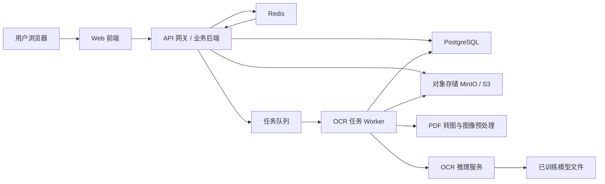
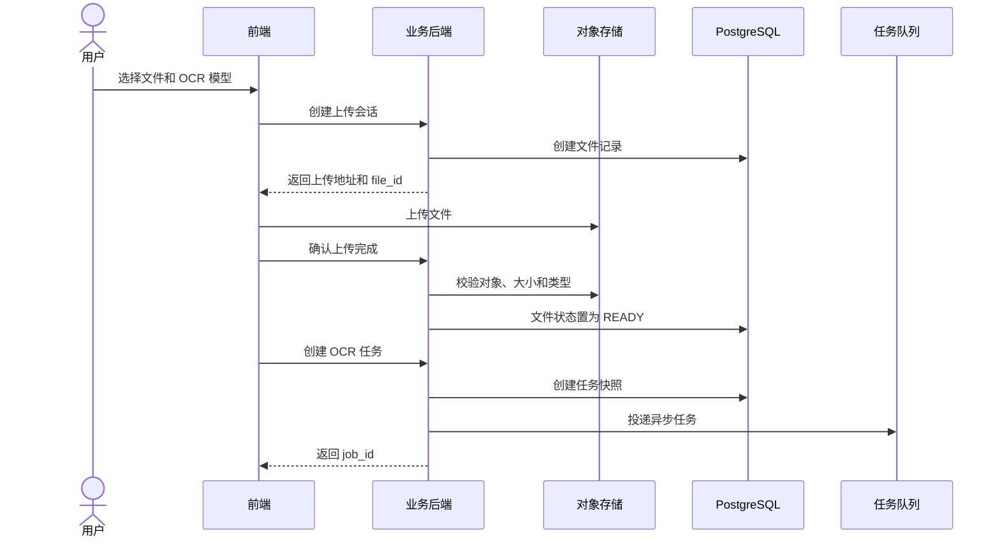
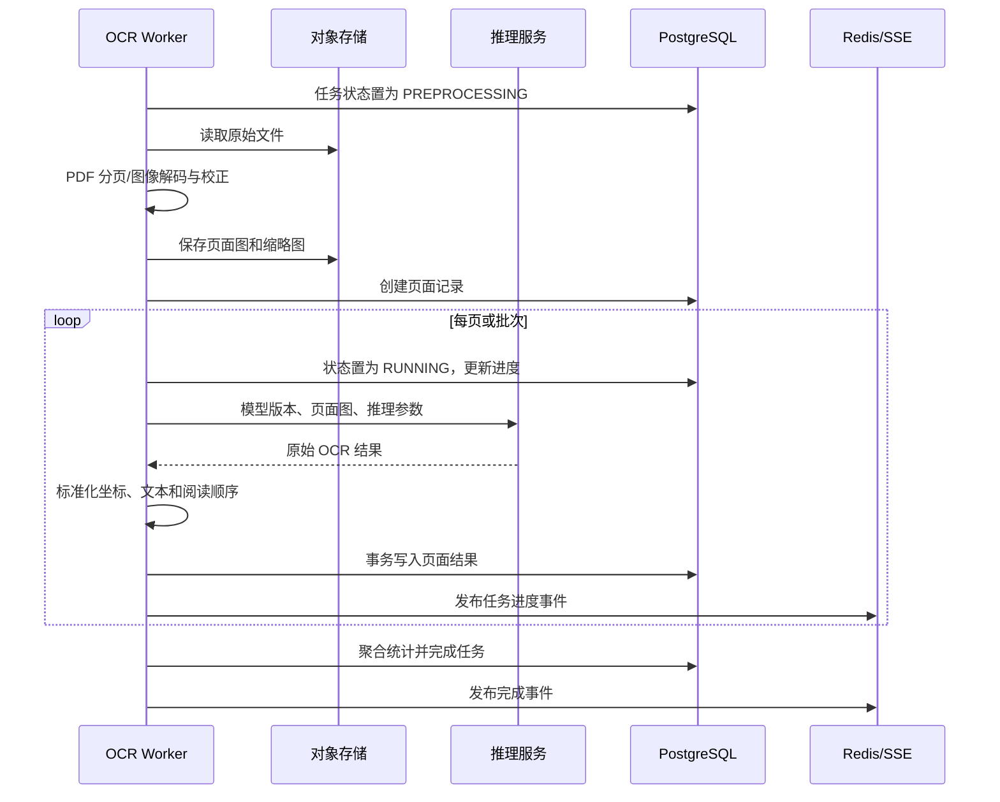
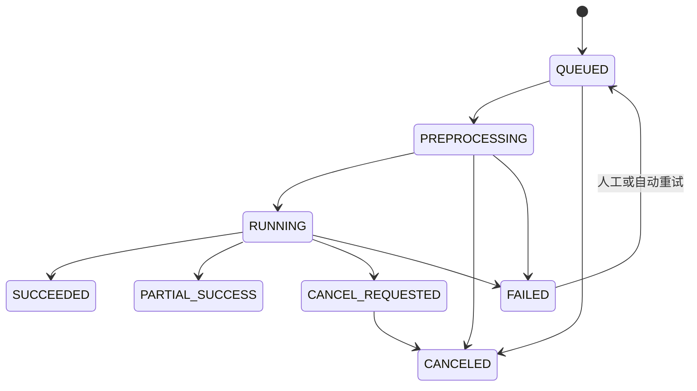
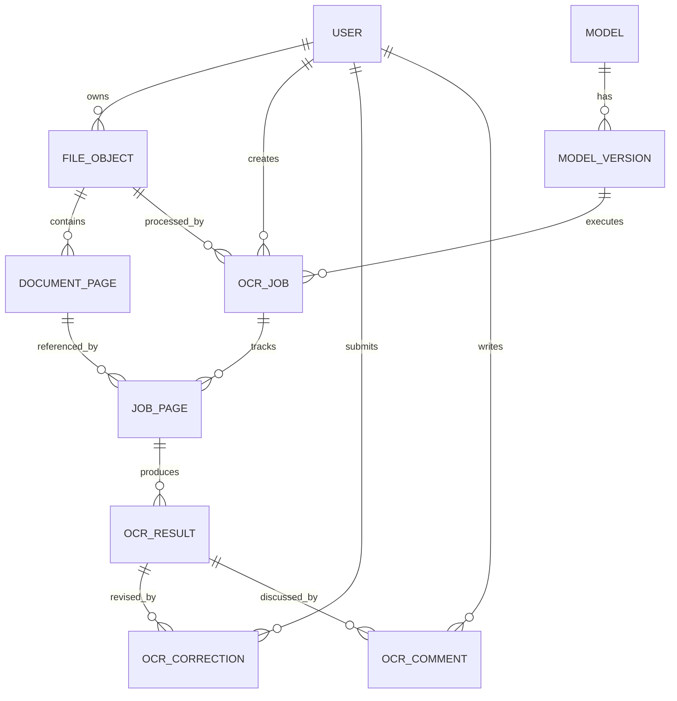

# 工业 OCR 检测系统架构设计

## 1. 文档目标

本文设计一个类似 PaddleOCR 在线识别平台的工业 OCR 检测应用。它是一个嵌入已训练 OCR 模型的应用网页：用户上传图片或 PDF，选择预先部署的模型执行识别，并在页面中联动展示原图、文字检测框和识别文本。

首期设计目标：

- 支持图片及多页 PDF。
- 支持多个 OCR 模型及模型版本。
- 返回文本、置信度、文字框和阅读顺序。
- 支持任务进度查询、失败重试和结果持久化。
- 前端支持画布缩放、框选、高亮及文字列表联动。
- OCR 推理层可独立扩缩容，便于后续接入 GPU 集群。

### 1.1 系统边界

本系统只负责已训练模型的配置、加载、选择和推理，不包含模型训练、数据标注、训练数据集管理、超参数管理或自动模型评测功能。模型由系统外部训练并交付为可部署制品；管理员将其配置到应用后，普通用户即可在网页中选择使用。

系统支持轻量级人工校对，但不建设独立的数据标注或模型训练工作台。用户可以在右侧识别结果列表中纠正文字并添加留言；这些人工内容用于当前业务文档的复核与协作，不自动进入训练集，也不会触发模型训练或自动评测。

人工校对只修改文本内容，不在首期提供检测框拖拽、框新增/删除、复杂版面编辑或标注任务分发。原始 OCR 输出保持不可变，人工纠正以独立修订记录保存，以便审计和恢复。

## 2. 总体架构

建议首期采用“模块化业务后端 + 独立 OCR 推理服务 + 异步任务队列”。业务后端保持单体，降低开发和运维复杂度；计算密集的推理服务独立部署，以便按模型和 GPU 资源扩容。

### 2.1 核心组件

| 组件 | 职责 |
|---|---|
| Web 前端 | 文件上传、模型选择、任务状态、图片与检测框渲染、文字列表联动 |
| API 网关/业务后端 | 鉴权、上传会话、任务编排、权限校验、结果查询、模型目录管理 |
| OCR Worker | 消费任务、PDF 分页、图像预处理、调用推理服务、结果标准化与持久化 |
| OCR 推理服务 | 加载模型、批量推理、返回模型原始识别结果；按 CPU/GPU 独立部署 |
| PostgreSQL | 用户、文件元数据、任务、页面、模型版本、识别结果及审计信息 |
| Redis | 短期任务状态、幂等键、限流、缓存；不作为最终结果存储 |
| 任务队列 | 解耦上传请求与耗时推理，支持重试、优先级和失败队列 |
| 对象存储 | 原始文件、PDF 页面图、缩略图、可选的可视化结果图 |
| 已训练模型存储 | 保存外部交付的模型权重、配置、字典和版本清单；仅供部署和推理，不提供训练能力 |

### 2.2 推荐部署阶段

**第一阶段：单机或小规模部署**

- Web 前端、业务后端、Worker、Redis、PostgreSQL、MinIO 通过容器部署。
- OCR 推理服务按 CPU 或单 GPU 部署。
- 业务后端不拆微服务，按内部模块划分文件、任务、模型和结果能力。

**第二阶段：生产扩容**

- 使用 Kubernetes 部署 Worker 和推理服务。
- 按模型类型建立独立队列，例如通用中文、英文、表格、行业专用模型。
- 根据队列深度、GPU 利用率和任务耗时自动扩缩容。
- 增加网关限流、集中日志、指标监控和链路追踪。

## 3. 前后端技术选型

### 3.1 前端

| 类别 | 推荐技术 | 选择原因 |
|---|---|---|
| 框架 | Vue 3 + TypeScript + Vite | 国内团队生态成熟，类型约束清晰，开发效率高 |
| UI 组件 | Element Plus | 上传、表格、进度、表单等后台系统组件完善 |
| 状态管理 | Pinia | 管理当前任务、页面、选中结果和筛选条件 |
| 请求层 | Axios 或基于 Fetch 的封装 | 支持统一鉴权、错误处理、取消和重试 |
| 图片/框渲染 | Konva.js | 适合 Canvas 图层、缩放、拖拽、框高亮及命中检测 |
| PDF 预览 | PDF.js | 浏览器端预览；正式 OCR 仍以后端渲染页面为准 |
| 实时状态 | SSE 优先，WebSocket 备选 | OCR 进度主要是服务端单向推送，SSE 更简单 |

前端采用统一坐标变换：后端返回原始页面像素坐标和归一化坐标，Canvas 根据当前显示尺寸计算缩放比例。检测框作为独立图层覆盖在图片上，不生成带框的新图片。

### 3.2 后端与基础设施

| 类别 | 推荐技术 | 选择原因 |
|---|---|---|
| 业务 API | FastAPI + Python | 与 OCR/Python 生态一致，异步接口和接口文档支持良好 |
| 数据校验 | Pydantic | 统一 API 输入输出和内部标准结果结构 |
| ORM/迁移 | SQLAlchemy + Alembic | 数据模型和数据库迁移成熟 |
| OCR 推理 | PaddleOCR 为首个适配器；预留 ONNX Runtime、TensorRT、厂商 API 适配器 | 兼顾快速上线与后续多模型统一接入 |
| 异步队列 | Celery + Redis；规模提升后可改 RabbitMQ | 首期部署简单，支持重试、超时与任务路由 |
| 数据库 | PostgreSQL | 事务、JSONB、索引和查询能力适合任务及 OCR 结果管理 |
| 对象存储 | MinIO（私有部署）或兼容 S3 的云存储 | 适合大文件、分片上传、签名 URL 和生命周期管理 |
| PDF 渲染 | PyMuPDF | PDF 分页和高分辨率渲染性能较好 |
| 可观测性 | Prometheus + Grafana；集中日志可用 Loki | 监控任务吞吐、失败率、队列深度、模型耗时和 GPU 指标 |
| 容器/编排 | Docker Compose 起步，Kubernetes 扩展 | 支持从单机平滑演进到 GPU 集群 |

### 3.3 关键选型原则

- 业务后端不直接加载大模型，避免 API 实例被 GPU、显存和模型初始化时间绑定。
- 每个模型通过统一的 `OCR Adapter` 接口接入，业务层只消费标准化结果。
- 文件二进制不进入 PostgreSQL，数据库只保存元数据和对象存储键。
- 大文件推荐使用对象存储直传，避免占满业务后端带宽和内存。

## 4. 模块设计

### 4.1 前端模块

- **上传区**：文件校验、分片/直传、上传进度、文件预览。
- **模型选择器**：展示模型名称、版本、语言、能力、运行状态及建议场景。
- **任务面板**：排队、预处理、识别中、成功、部分成功、失败等状态。
- **页面导航**：多页 PDF 的页码、缩略图和当前页切换。
- **检测画布**：底图、检测框、选中框、悬停框四层渲染。
- **文字列表**：按阅读顺序展示文本、置信度和序号，支持搜索与低置信度筛选。鼠标悬停或选中某条结果时，在条目右侧显示“纠正”和“留言”两个悬浮按钮。
- **联动控制器**：维护 `selectedResultId`；点击列表定位并高亮框，点击框滚动并高亮列表项。
- **人工校对**：“纠正”打开小型编辑浮层，显示原始文本并输入纠正文本；“留言”打开留言浮层，支持查看和新增该结果的讨论。提交后列表优先显示最新有效纠正，同时保留“已纠正”标识和原文查看入口。

### 4.2 后端模块

- **认证与权限模块**：用户、租户、角色、文件及任务访问控制。
- **文件模块**：上传会话、格式校验、哈希、对象存储、文件生命周期。
- **模型目录模块**：登记已训练模型的元数据、版本、能力、状态和默认参数，供网页选择；不负责训练或评测。
- **任务编排模块**：创建任务、幂等控制、任务状态机、取消及重试。
- **文档处理模块**：PDF 分页、方向校正、分辨率控制、图像预处理。
- **推理适配模块**：调用不同模型，处理超时，统一模型输出。
- **结果模块**：阅读顺序、坐标转换、结果持久化、分页查询和导出扩展。
- **校对协作模块**：文字纠正、修订历史、留言、权限校验和操作审计；不改变模型原始输出。
- **审计与监控模块**：记录操作人、模型版本、耗时、错误码及资源用量。

## 5. 数据流

### 5.1 上传与任务创建

小文件也可由业务后端接收后写入对象存储，但 API 保持一致。上传确认时必须校验文件扩展名、MIME、文件签名、大小、页数上限，并执行安全扫描策略。

### 5.2 OCR 处理

### 5.3 前端结果展示与联动

1. 前端通过 SSE 接收进度，也保留轮询接口作为降级方案。
2. 当前页完成后即可拉取该页信息和识别结果，无需等待整份 PDF。
3. 前端加载页面图，根据图像实际宽高建立 Canvas 坐标系。
4. 检测框用 `polygon` 绘制；轴对齐矩形仅作为快速布局和列表定位辅助。
5. 点击文字列表项后，以结果 ID 设置选中状态，画布将对应框置顶高亮并平移到可视区域。
6. 点击检测框后，文字列表滚动到相同结果 ID，并高亮对应条目。
7. 悬停或选中文字条目时显示“纠正”和“留言”按钮；纠正提交后局部刷新该结果，留言提交后更新留言数量，不重新执行 OCR。

## 6. 任务状态机

状态含义：

| 状态 | 含义 |
|---|---|
| `QUEUED` | 已创建并等待 Worker |
| `PREPROCESSING` | 文件解码、PDF 分页或图像预处理 |
| `RUNNING` | 正在调用 OCR 模型，可按页面更新进度 |
| `SUCCEEDED` | 所有页面成功 |
| `PARTIAL_SUCCESS` | 部分页面成功，部分页面失败 |
| `CANCEL_REQUESTED` | 已请求取消，等待安全中断点 |
| `CANCELED` | 已取消 |
| `FAILED` | 任务失败，记录结构化错误信息 |

任务进度建议由 `completed_pages / total_pages` 计算，并附带当前阶段，避免只展示不准确的百分比。

## 7. API 设计

### 7.1 通用规范

- 基础路径：`/api/v1`。
- 鉴权：企业部署推荐 OIDC/OAuth 2.0；简单部署可用短期 JWT。
- ID：使用 UUIDv7，兼顾全局唯一和数据库索引局部性。
- 时间：ISO 8601 UTC，前端按用户时区显示。
- 分页：游标分页，参数为 `cursor` 和 `limit`。
- 幂等：创建任务支持 `Idempotency-Key`，避免重复提交。
- 错误：统一返回 `code`、`message`、`request_id` 和可选 `details`。
- 大文件：优先返回对象存储预签名上传地址；地址短期有效且仅允许指定对象键。
- API 返回资源 URL 时，生产环境推荐短期签名 URL 或受控下载接口。

### 7.2 模型 API

| 方法 | 路径 | 用途 | 主要返回 |
|---|---|---|---|
| GET | `/models` | 查询当前用户可用模型 | 模型 ID、名称、语言、能力、默认版本、状态 |
| GET | `/models/{model_id}` | 查询模型详情及可用版本 | 版本、参数约束、输入限制、说明 |

模型查询只返回已发布且健康的版本；任务创建时必须固定具体版本，不能仅保存“默认版本”。

### 7.3 文件 API

| 方法 | 路径 | 用途 | 主要请求/返回 |
|---|---|---|---|
| POST | `/files/upload-sessions` | 创建上传会话 | 文件名、大小、MIME、哈希；返回 file_id、上传地址 |
| POST | `/files/{file_id}/complete` | 确认上传完成并校验 | 可选分片信息；返回文件状态 |
| GET | `/files/{file_id}` | 查询文件元数据 | 类型、大小、页数、状态 |
| DELETE | `/files/{file_id}` | 逻辑删除文件 | 删除状态；物理文件由生命周期任务清理 |

### 7.4 OCR 任务 API

| 方法 | 路径 | 用途 | 主要请求/返回 |
|---|---|---|---|
| POST | `/ocr/jobs` | 创建 OCR 任务 | file_id、model_id、model_version、options；返回 job_id |
| GET | `/ocr/jobs/{job_id}` | 查询状态和总体进度 | 状态、阶段、页数、进度、耗时、错误 |
| POST | `/ocr/jobs/{job_id}/cancel` | 请求取消 | 最新任务状态 |
| POST | `/ocr/jobs/{job_id}/retry` | 重试失败任务或失败页面 | 新 job_id 或重试批次 ID |
| GET | `/ocr/jobs/{job_id}/events` | SSE 任务事件流 | 状态、页面完成、进度、失败和完成事件 |
| GET | `/ocr/jobs` | 查询任务历史 | 游标分页的任务摘要 |

创建任务的核心字段：

| 字段 | 类型 | 必填 | 说明 |
|---|---|---|---|
| `file_id` | UUID | 是 | 已完成并校验通过的文件 |
| `model_id` | string | 是 | 模型逻辑标识 |
| `model_version` | string | 是 | 固定模型版本，保证结果可复现 |
| `pages` | 页码数组或范围 | 否 | PDF 指定页；默认全部 |
| `options` | object | 否 | 方向分类、语言、阈值等已声明参数 |
| `client_reference` | string | 否 | 调用方业务标识 |

### 7.5 页面与结果 API

| 方法 | 路径 | 用途 | 主要返回 |
|---|---|---|---|
| GET | `/ocr/jobs/{job_id}/pages` | 查询页面列表和页面级状态 | 页码、尺寸、缩略图、状态、结果数 |
| GET | `/ocr/jobs/{job_id}/pages/{page_no}` | 查询当前页面信息 | 页面图 URL、原始尺寸、旋转角、状态 |
| GET | `/ocr/jobs/{job_id}/pages/{page_no}/results` | 查询页面 OCR 结果 | 结果列表、阅读顺序、坐标、置信度 |
| GET | `/ocr/jobs/{job_id}/results` | 获取全任务聚合文本 | 按页面组织的文本和统计；大文档建议流式或导出 |

页面结果接口默认按阅读顺序返回。若单页结果极多，可按 `cursor` 分页，但应同时提供当前页完整框数据的压缩响应，以免画布漏绘。

### 7.6 人工校对与留言 API

| 方法 | 路径 | 用途 | 主要请求/返回 |
|---|---|---|---|
| POST | `/ocr/results/{result_id}/corrections` | 提交文字纠正 | corrected_text、base_revision；返回最新有效文本和修订版本 |
| GET | `/ocr/results/{result_id}/corrections` | 查询纠正历史 | 原文、修订内容、操作人、时间和当前版本 |
| POST | `/ocr/results/{result_id}/corrections/{correction_id}/revert` | 撤销到指定修订 | 返回新的修订版本，不物理删除历史 |
| GET | `/ocr/results/{result_id}/comments` | 查询留言 | 游标分页的留言列表 |
| POST | `/ocr/results/{result_id}/comments` | 新增留言 | content；返回留言 ID、操作人和时间 |
| PATCH | `/ocr/results/{result_id}/comments/{comment_id}` | 修改本人留言 | content；返回更新后的留言 |
| DELETE | `/ocr/results/{result_id}/comments/{comment_id}` | 删除本人留言 | 逻辑删除状态 |

纠正接口使用 `base_revision` 做乐观并发控制。如果另一位用户已先提交修改，接口返回版本冲突及最新内容，由前端提示用户比较后重新提交，避免静默覆盖。

### 7.7 典型响应结构

以下为字段示意，不限定序列化实现：

| 层级 | 字段 | 类型 | 说明 |
|---|---|---|---|
| 页面 | `job_id` | UUID | OCR 任务 ID |
| 页面 | `page_id` | UUID | 页面 ID |
| 页面 | `page_no` | integer | 从 1 开始的页码 |
| 页面 | `image` | object | 页面图地址、宽、高、旋转信息 |
| 页面 | `coordinate_system` | object | 坐标原点、单位、归一化规则 |
| 页面 | `items` | array | OCR 结果数组 |
| 结果 | `id` | UUID | 前端联动使用的稳定结果 ID |
| 结果 | `type` | enum | `text_line`、`word`、`table_cell` 等 |
| 结果 | `text` | string | 识别文本 |
| 结果 | `display_text` | string | 最新人工纠正文本；无纠正时等于 text |
| 结果 | `is_corrected` | boolean | 是否存在有效人工纠正 |
| 结果 | `revision` | integer | 当前纠正版本，用于并发控制 |
| 结果 | `comment_count` | integer | 当前有效留言数量 |
| 结果 | `confidence` | number | 0 到 1 |
| 结果 | `polygon` | point array | 顺时针四点或多点多边形 |
| 结果 | `bbox` | object | 轴对齐包围框 x、y、width、height |
| 结果 | `normalized_polygon` | point array | 0 到 1 的归一化坐标 |
| 结果 | `reading_order` | integer | 页面内阅读顺序 |
| 结果 | `angle` | number | 文本方向角度 |
| 结果 | `attributes` | object | 模型扩展属性，保持可扩展性 |

## 8. 数据结构

### 8.1 核心实体关系

### 8.2 数据表设计

#### `users`

| 字段 | 类型 | 说明 |
|---|---|---|
| `id` | UUID | 主键 |
| `tenant_id` | UUID | 租户 ID，单租户可固定值 |
| `name` | varchar | 显示名称 |
| `status` | varchar | active、disabled |
| `created_at` | timestamptz | 创建时间 |

#### `file_objects`

| 字段 | 类型 | 说明 |
|---|---|---|
| `id` | UUID | 主键 |
| `tenant_id` / `owner_id` | UUID | 权限边界 |
| `original_name` | varchar | 原始文件名，仅用于显示 |
| `media_type` | varchar | 实际检测后的 MIME |
| `size_bytes` | bigint | 文件大小 |
| `sha256` | char(64) | 完整性校验和可选去重 |
| `storage_key` | varchar | 对象存储键，不保存公开 URL |
| `kind` | varchar | image、pdf |
| `page_count` | integer | 图片为 1，PDF 为页数 |
| `status` | varchar | uploading、validating、ready、rejected、deleted |
| `created_at` / `deleted_at` | timestamptz | 生命周期时间 |

#### `document_pages`

| 字段 | 类型 | 说明 |
|---|---|---|
| `id` | UUID | 主键 |
| `file_id` | UUID | 所属文件 |
| `page_no` | integer | 从 1 开始，文件内唯一 |
| `image_storage_key` | varchar | 后端渲染后的标准页面图 |
| `thumbnail_storage_key` | varchar | 缩略图 |
| `width_px` / `height_px` | integer | OCR 坐标基准尺寸 |
| `render_dpi` | integer | PDF 渲染 DPI |
| `rotation` | smallint | 应用到页面图的旋转角 |
| `source_metadata` | jsonb | 原 PDF 页面尺寸等扩展信息 |

#### `models` 与 `model_versions`

| 表 | 关键字段 | 说明 |
|---|---|---|
| `models` | id、name、provider、task_type、languages、status | 模型逻辑信息和能力目录 |
| `model_versions` | id、model_id、version、runtime、artifact_uri、config、status、created_at | 不可变版本及运行配置 |

已训练模型由外部流程交付给本应用。模型版本发布后不覆盖权重；新的模型制品必须产生新版本。任务保存模型版本 ID 和参数快照，从而保证审计及复现。这里的“发布”仅指将已有模型配置为可供推理使用，不涉及训练、自动评测或训练流水线。

#### `ocr_jobs`

| 字段 | 类型 | 说明 |
|---|---|---|
| `id` | UUID | 主键 |
| `tenant_id` / `created_by` | UUID | 权限与审计 |
| `file_id` | UUID | 输入文件 |
| `model_version_id` | UUID | 固定模型版本 |
| `status` / `stage` | varchar | 总体状态及当前阶段 |
| `options_snapshot` | jsonb | 经过校验的推理参数快照 |
| `total_pages` / `completed_pages` / `failed_pages` | integer | 页面进度 |
| `result_count` | integer | 总结果数 |
| `queued_at` / `started_at` / `finished_at` | timestamptz | 性能和排队统计 |
| `error_code` / `error_message` | varchar / text | 结构化失败原因，避免保存敏感堆栈 |
| `request_id` / `client_reference` | varchar | 调用链及业务追踪 |

#### `job_pages`

| 字段 | 类型 | 说明 |
|---|---|---|
| `id` | UUID | 主键 |
| `job_id` / `page_id` | UUID | 任务和页面；组合唯一 |
| `status` | varchar | pending、running、succeeded、failed、skipped |
| `result_count` | integer | 当前页结果数 |
| `processing_ms` | integer | 页面处理耗时 |
| `attempt_count` | integer | 重试次数 |
| `error_code` / `error_message` | varchar / text | 页面级错误 |
| `started_at` / `finished_at` | timestamptz | 页面级时间 |

#### `ocr_results`

| 字段 | 类型 | 说明 |
|---|---|---|
| `id` | UUID | 主键，也是前端框与文字列表的关联键 |
| `job_page_id` | UUID | 所属任务页面 |
| `result_type` | varchar | text_line、word、table_cell 等 |
| `text` | text | 识别文字 |
| `confidence` | real | 0 到 1 |
| `current_correction_id` | UUID，可空 | 当前有效人工纠正，指向 ocr_corrections |
| `polygon` | jsonb | 原图像素坐标多边形 |
| `normalized_polygon` | jsonb | 归一化多边形 |
| `bbox_x/y/width/height` | real | 轴对齐包围框，便于筛选和渲染 |
| `angle` | real | 文本角度 |
| `reading_order` | integer | 页面内排序，建立组合索引 |
| `attributes` | jsonb | 字符置信度、语言、模型原始标签等扩展属性 |

当结果量达到数亿级时，可按创建月份或租户对 `ocr_results` 分区，并将长期历史任务归档为对象存储中的结构化结果文件。

#### `ocr_corrections`

| 字段 | 类型 | 说明 |
|---|---|---|
| `id` | UUID | 主键 |
| `result_id` | UUID | 被纠正的 OCR 结果 |
| `revision` | integer | 结果内递增版本号，与 result_id 组合唯一 |
| `base_revision` | integer | 提交时用户看到的版本，用于冲突检测 |
| `corrected_text` | text | 纠正后的文字 |
| `created_by` | UUID | 操作人 |
| `created_at` | timestamptz | 操作时间 |
| `reverts_correction_id` | UUID，可空 | 若为撤销操作，指向被恢复的历史修订 |

`ocr_results.text` 始终保存模型原文。最新有效纠正可通过结果表上的 `current_correction_id` 外键快速读取，也可由修订历史计算；推荐保存该外键并在同一事务中更新，以兼顾查询性能和完整审计。

#### `ocr_comments`

| 字段 | 类型 | 说明 |
|---|---|---|
| `id` | UUID | 主键 |
| `result_id` | UUID | 留言所属 OCR 结果 |
| `content` | text | 留言正文，限制长度并按纯文本展示 |
| `created_by` | UUID | 留言人 |
| `created_at` / `updated_at` | timestamptz | 创建及更新时间 |
| `deleted_at` / `deleted_by` | timestamptz / UUID | 逻辑删除与审计信息 |

### 8.3 坐标规范

坐标是前后端联动最容易出错的部分，建议固定以下契约：

- 原点位于后端生成的标准页面图左上角。
- x 向右、y 向下，像素坐标使用浮点数。
- `polygon` 点按顺时针排列，首点尽量为视觉上的左上角。
- `bbox` 是多边形的轴对齐外接矩形，不代替倾斜文字框。
- `normalized_polygon.x = x / image.width`，`normalized_polygon.y = y / image.height`。
- 前端渲染优先使用像素坐标；响应式布局、缩略图或跨分辨率场景可使用归一化坐标。
- 页面方向校正后，所有坐标均以校正并保存后的页面图为准，禁止混用原 PDF 坐标。

## 9. 推理服务接口约束

推理服务为内部接口，不直接暴露给浏览器。所有模型适配器至少接受：模型版本、图像引用或图像数据、请求 ID、推理参数；至少返回：文本、置信度、多边形、角度、模型耗时和可选扩展信息。

适配器负责将 PaddleOCR、ONNX 模型、TensorRT 服务或第三方 OCR 的差异转换为统一结果。业务 Worker 负责进一步校验坐标范围、生成 bbox、计算归一化坐标和阅读顺序。

建议能力声明包括：

- 支持语言和输入格式。
- 最大图像尺寸、最大批次和推荐 DPI。
- 是否支持方向分类、文字检测、文字识别、版面分析、表格或手写体。
- 可配置参数及每个参数的类型、范围和默认值。
- 运行资源类型、健康状态和当前版本。

## 10. 异常、幂等与重试

- 上传确认、任务创建和任务重试都应具备幂等语义。
- Worker 采用“至少一次”消费；写入结果时以 `job_page_id + result序号/稳定指纹` 或页面事务防止重复。
- 页面识别结果应在单个数据库事务内替换或提交，避免页面显示半份结果。
- 仅对超时、临时网络故障、推理实例不可用等可恢复错误自动重试，并使用指数退避。
- 文件损坏、格式不支持、页数超限、参数非法等业务错误不自动重试。
- 单页失败不阻断其他页面，最终任务可进入 `PARTIAL_SUCCESS`。
- 失败任务进入死信队列，保留 request_id、模型版本、页面和错误码供排查。

## 11. 安全与工业场景要求

- 文件内容默认视为不可信：校验文件签名、限制解压/渲染资源、隔离 PDF 处理进程并设置超时。
- 对文件大小、PDF 页数、单页像素、并发任务和租户配额设置硬限制，防止资源耗尽。
- 原文件和识别结果按租户隔离；对象存储桶禁止公开访问。
- 下载地址使用短期签名，并在业务后端完成权限校验。
- 日志不记录文档正文、完整文件名、签名 URL 或访问令牌。
- 纠正和留言必须记录操作人、时间及修订历史；普通用户只能修改或删除自己的留言，纠正撤销权限可按角色配置。
- 留言按纯文本处理并限制长度，前端输出转义，防止脚本注入；敏感内容不得写入通用运行日志。
- 敏感工业部署建议支持内网离线运行、静态加密、传输加密和审计日志。
- 设置数据保留策略：例如原文件、页面图、结果分别配置保留期限，并支持用户主动删除。
- 模型制品保存校验和及签名，推理实例只加载已发布版本。

## 12. 性能与可观测性

重点指标：

- API 请求量、P95/P99 延迟和错误率。
- 上传吞吐、文件校验失败率及对象存储错误率。
- 队列深度、排队时间、任务成功率和各阶段耗时。
- 每模型每页耗时、模型加载时间、批处理大小和推理错误率。
- GPU 利用率、显存、CPU、内存及 Worker 并发数。
- 单页结果数、PDF 页数分布和低置信度结果比例。

每个请求和异步任务贯穿统一 `request_id`/`job_id`。告警至少覆盖：队列持续增长、任务失败率突增、GPU OOM、对象存储不可用、数据库连接耗尽和推理实例无健康副本。

## 13. 建议的首期范围与演进路线

### MVP

- 图片与 PDF 上传，限制文件大小和页数。
- PaddleOCR 一个通用模型加一个可切换模型版本。
- 异步任务、进度轮询/SSE、逐页结果展示。
- 左图右文、框和文本双向联动、置信度展示。
- 右侧结果项悬浮“纠正”和“留言”按钮，支持文字修订历史及结果级留言。
- PostgreSQL、Redis、MinIO 和基础运行指标。

### 第二期

- GPU 多实例与按模型路由、任务优先级、批量推理。
- 更多已训练模型适配器、版本切换和部署灰度控制。
- 结果导出、全文搜索、低置信度筛选和多人校对冲突提示。
- 租户配额、审计、数据保留策略和完整监控告警。

### 第三期

- 接入具备版面分析、表格识别、键值对提取能力的已训练模型。
- 增加行业模板配置、结果查询和业务系统集成能力。
- 大规模结果分区、冷热分层及多地域容灾。

## 14. 关键决策总结

1. API 请求只负责创建任务，OCR 通过队列异步执行，避免长连接超时。
2. 业务后端与 OCR 推理服务分离，支持不同模型和 GPU 独立扩缩容。
3. 所有任务固定模型版本和参数快照，保证结果可审计、可复现。
4. PDF 在后端统一分页并生成标准页面图，所有框坐标以该页面图为基准。
5. 检测框和文字列表通过稳定的 OCR 结果 ID 联动，前端以独立 Canvas 图层渲染。
6. 文件存对象存储，业务数据和查询索引存 PostgreSQL，Redis 只保存短期状态和缓存。
7. 先以模块化单体交付业务能力，只有推理层独立；随着负载增长再拆分服务。
8. 系统是推理应用而非模型研发平台，所有模型均在外部训练完成后以版本化制品接入。
9. 人工校对是业务复核功能：模型原始文本不可变，纠正和留言独立存储、版本化并可审计，且不会自动用于模型训练。

## 15. 前端 Mock 原型

首期前端原型采用 Vue 3、TypeScript、Ant Design Vue 和 Konva 实现，使用本地 Mock 数据模拟多页 PDF、多个 OCR 模型、任务进度、检测框、识别结果、文字纠正和结果留言。原型不调用后端 API，刷新页面后人工修改和新增留言会恢复为初始 Mock 状态。

文档展示区域与 OCR 结果区域之间使用前端分割面板提供水平拖拽调整。文档区域最小宽度为 400px，结果区域最小宽度为 300px；调整宽度不改变两侧独立滚动、检测框点击、结果定位、搜索和人工纠正行为。

结果面板支持将当前页面 OCR 数据直接导出为 Excel，不经过后端。精简导出仅包含编号和最终识别结果；完整导出同时包含模型原文、人工纠正、最终结果及留言信息。存在多条留言时，每条留言独立占一行；导出使用完整当前页结果，不受页面搜索和低置信度筛选状态影响。

右侧识别结果支持列表和原位布局两种展示模式，默认使用列表模式。原位布局不显示原图，而是将最终识别文字按 `[x1,y1,x2,y2]` 映射到与原文档等比例的独立画布中；筛选只控制文字块可见性，不重新排列坐标。两种模式共用选中结果、搜索、低置信度筛选、纠正和留言事件，切换 PDF 页面时保留当前展示模式。中间文档及 Konva 检测框渲染保持不变。

前端使用 Vue Router 管理工作台和任务记录页面：`/workspace` 为默认工作台，`/workspace/:taskId` 使用任务 ID 模拟加载历史任务，`/tasks` 展示 Mock 任务列表。任务记录支持搜索、状态筛选、时间排序、查看、继续复核、前端导出和带确认的内存删除；刷新后删除的 Mock 任务恢复。

顶部设置入口打开全局设置抽屉。默认模型、低置信度阈值、结果展示模式、置信度显示、Excel 导出类型和页面缩放以 `ddocr.settings.v1` 保存到浏览器 localStorage，并支持恢复默认值。用户头像菜单使用 Mock 用户信息，提供个人资料抽屉、带前端校验的修改密码表单和模拟退出确认，不接入真实身份认证。
