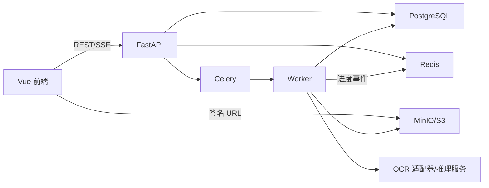

# 后端架构

## 1. 架构与技术选型

首期采用“模块化单体 FastAPI + 独立 Celery Worker + 可替换 OCR 推理适配器”。业务 API 不在 HTTP 请求中执行 OCR。

| 类别 | 选型 |
|---|---|
| API | Python 3.11、FastAPI、Uvicorn、Pydantic v2 |
| 数据 | PostgreSQL 16+、SQLAlchemy 2.x、Alembic |
| 异步 | Celery 5.x、Redis 7+ |
| 对象存储 | MinIO（私有部署）或 S3 |
| PDF/图像 | PyMuPDF、Pillow/OpenCV |
| OCR | PaddleOCR 首期；ONNX Runtime；GPU 可用 TensorRT/Triton |
| Excel | openpyxl 流式写模式 |
| 测试 | pytest、pytest-asyncio、httpx、Testcontainers |
| 可观测性 | structlog、OpenTelemetry、Prometheus/Grafana |

首期不同时引入 Django，避免双 ORM 和双认证体系。未来确需 Django Admin 时再独立评估。

## 2. 组件关系



## 3. 推荐目录

```text
backend/
├─ pyproject.toml
├─ alembic.ini
├─ src/ddocr/
│  ├─ main.py
│  ├─ api/{dependencies,errors,v1/}
│  ├─ core/{config,security,logging,telemetry,idempotency}.py
│  ├─ db/{session,models,repositories,migrations}/
│  ├─ schemas/
│  ├─ services/
│  ├─ storage/{base,s3,keys}.py
│  ├─ inference/{base,registry,paddle_adapter,onnx_adapter,remote_adapter}.py
│  ├─ workers/{celery_app,file_tasks,ocr_tasks,export_tasks,cleanup_tasks}.py
│  └─ events/{publisher,sse}.py
├─ tests/{unit,integration,contract,fixtures}/
├─ Dockerfile.api
└─ Dockerfile.worker
```

路由只处理 HTTP，服务层定义事务，repository 访问数据库，推理引擎只通过适配器协议接入。

## 4. 核心数据表

| 表 | 核心内容 |
|---|---|
| `tenants` | 租户边界和状态 |
| `users` | 外部身份 subject、显示资料和状态 |
| `user_preferences` | 可选 preferences_version 与 JSONB 设置 |
| `models` | 逻辑模型、能力、语言和状态 |
| `model_versions` | 不可变版本、runtime、制品 URI/哈希和配置 |
| `file_objects` | owner、文件名、真实 MIME、大小、SHA-256、对象键、页数、状态、删除时间 |
| `document_pages` | file、页码、标准图/缩略图对象键、宽高、DPI、旋转 |
| `ocr_jobs` | tenant、creator、file、模型版本、参数快照、status/stage/review_status、进度计数、错误和时间 |
| `job_pages` | job/page、页面状态、结果数、耗时、重试次数和错误 |
| `ocr_results` | 原文、confidence、bbox 四列、polygon、阅读顺序、当前修订 |
| `ocr_corrections` | result、revision、base_revision、纠正文、作者、时间和撤销指向 |
| `ocr_comments` | result、纯文本内容、作者、创建/更新时间和逻辑删除字段 |
| `export_jobs` | job、格式、模式、范围、状态、对象键、过期时间和错误 |
| `idempotency_keys` | 用户、路由、键、请求哈希和原响应 |
| `audit_logs` | actor、action、resource 和审计元数据 |

关键唯一约束：`model_id + version`、`file_id + page_no`、`job_id + page_id`、`result_id + revision`。常用索引：任务租户/状态/创建时间、结果页面/阅读顺序、纠正结果/版本、留言结果/时间。

纠正事务锁定 result 行、检查 `base_revision`、插入修订并更新当前修订。单页结果在一个事务内整体提交，避免半页结果。搜索首期使用 PostgreSQL `pg_trgm`，超大规模再评估 OpenSearch。

## 5. OCR 模型接入

统一内部协议：

```text
infer(page_image, model_version, validated_options, request_id)
  -> list[{text, confidence, bbox?, polygon?, angle?, attributes?}]
```

- 适配器声明语言、输入限制、检测/识别/方向/版面能力、资源类型和参数 schema。
- 输出统一进行坐标修正、BBox 生成、范围校验、阅读顺序计算和稳定 ID 生成。
- 错误映射为稳定错误码：`MODEL_UNAVAILABLE`、`INFERENCE_TIMEOUT`、`INVALID_MODEL_OUTPUT`、`GPU_OUT_OF_MEMORY`。
- MVP 中 PaddleOCR/ONNX 可与专用 Worker 同进程；扩展后通过 remote adapter 调用独立 GPU 服务。
- 队列按 runtime/model 路由，如 `ocr.cpu`、`ocr.gpu.steel`。
- 模型制品由外部训练流程发布；同一版本不得覆盖，加载时校验 SHA-256。

## 6. 文件与坐标处理

上传完成后校验真实 MIME、大小、SHA-256、页数和像素。PDF 在隔离且限时的进程中按固定 DPI 生成标准页面图及缩略图；图片应用 EXIF 方向归一化。前端展示和 OCR 必须使用同一标准图。

对象键建议：

```text
tenants/{tenant_id}/files/{file_id}/source
tenants/{tenant_id}/files/{file_id}/pages/{page_no}/page.png
tenants/{tenant_id}/files/{file_id}/pages/{page_no}/thumbnail.webp
tenants/{tenant_id}/jobs/{job_id}/exports/{export_id}.xlsx
models/{model_id}/{version}/{artifact_sha256}/...
```

PostgreSQL 只保存对象键。下载前做权限校验，再生成 5～15 分钟签名 URL。原文件、页面图和导出物使用独立保留策略；删除共享文件前检查引用。

## 7. 异步任务

流水线：文件校验 → PDF 渲染/图片归一化 → 按页 fan-out → 预处理 → OCR → 结果规范化与事务落库 → 聚合统计。

- API 创建 job 后通过 transactional outbox 投递 Celery，避免数据库提交与消息发送不一致。
- Celery 至少一次投递；任务和页面写入必须幂等。
- 临时网络、超时和推理实例不可用使用指数退避加抖动；损坏文件和非法参数不重试。
- 设置软/硬超时、最大重试和死信队列；死信不保存 OCR 正文。
- 单页失败不阻塞其他页，最终可为 `partial_success`；支持定向重试。
- 取消为协作式取消，Worker 在页面边界检查取消标志。
- OCR 与导出使用独立队列，避免 Excel 生成占用 GPU Worker。
- Worker 更新 PostgreSQL 后向 Redis 发布轻量事件；Redis 丢失事件不影响最终状态。

## 8. 测试要求

- 单元：状态机、BBox、模型规范化、权限、进度和导出行。
- 契约：所有 [04_API.md](04_API.md) 路径、状态码、字段和错误格式。
- 数据库：纠正冲突、幂等、逻辑删除、回滚和租户隔离。
- Worker：重复投递、超时重试、单页失败、取消、死信和聚合。
- 存储：签名上传、哈希、URL 过期、无权下载和生命周期。
- E2E：上传到识别、刷新恢复、BBox 对齐、纠正、留言和全任务导出。

