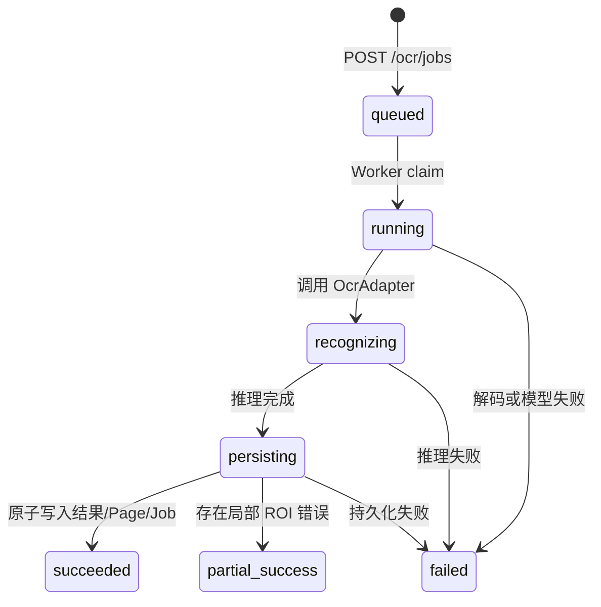

# 异步 OCR 任务架构

实施日期：2026-07-23。

## 状态机



## 调用关系

```mermaid
flowchart LR
    Vue["Vue（需要轮询）"] -->|POST /ocr/jobs| API["FastAPI"]
    API -->|创建 queued Job + Page| DB[(Database)]
    API -->|submit(job_id)| Worker["OcrTaskWorker"]
    API -->|HTTP 202 queued| Vue
    Worker --> Engine["单实例 TerminalOcrEngine"]
    Engine --> Adapter["OcrAdapter"]
    Adapter --> Worker
    Worker -->|recognizing / persisting| DB
    Worker -->|原子 results + page + job| DB
    Vue -->|GET /ocr/jobs/{id}| API
```

`POST /ocr/jobs` 不再执行 OCR，只创建 `queued` Job/Page 并立即返回原有 HTTP 202
响应。应用内只有一个 `TerminalOcrEngine` 和一个单线程 `OcrTaskWorker`，避免同一
PaddleOCR 实例并发调用。应用退出时先等待 Worker，再关闭 Engine。

成功持久化由 `OCRResultRepository.replace_page_results()` 在同一个 SQLAlchemy
事务内完成：删除该页旧结果、插入新 results、更新 page 汇总、更新 job 终态。

## 修改文件

- `backend/app/workers/__init__.py`
- `backend/app/workers/ocr_task.py`
- `backend/app/services/core.py`
- `backend/app/repositories/file_job.py`
- `backend/app/repositories/page_result.py`
- `backend/app/main.py`
- `backend/tests/ocr_fakes.py`
- `backend/tests/test_api.py`
- `backend/tests/test_file_job_relational.py`
- `backend/tests/test_page_result_relational.py`
- `backend/tests/test_correction_comment_relational.py`
- `backend/tests/test_export_idempotency_relational.py`
- `backend/tests/integration/test_real_ocr_api.py`

REST 路径、请求体、响应字段、数据库 Schema 和 Vue 文件均未改变。

## 前端需要配合的轮询

当前 Vue 在 POST 成功后立即读取 Pages/Results，并直接把页面标记为完成。异步后必须：

1. 接收 POST 返回的 `job_id` 和 `queued` 状态。
2. 每 1～2 秒调用 `GET /ocr/jobs/{job_id}`。
3. `queued/running` 时显示服务端 progress/stage，不读取最终结果。
4. `succeeded/partial_success` 时再读取 Pages/Results 并停止轮询。
5. `failed/cancelled` 时停止轮询并展示错误。
6. 页面卸载或切换任务时取消定时器和在途请求。

在前端完成上述调整前，后端异步任务会正确执行，但当前页面会过早读取空结果。
